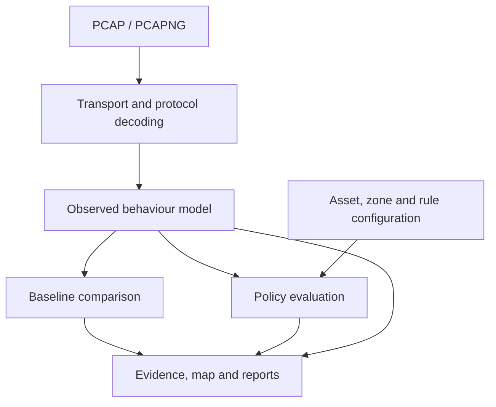

# OTScope

Passive Industrial Network Behaviour and Security Profiler


OTScope is a passive Python tool for analysing packet captures from industrial networks. It builds a model of observed assets and communications, extracts protocol-level activity, and compares later captures against a known-good baseline.

The current release supports PCAP and PCAPNG files, Modbus/TCP, IEC 60870-5-104, and common S7comm operations.

> OTScope is an early-stage defensive assessment tool. Findings identify behaviour worth investigating. They do not prove malicious activity.

## Project background

OTScope started as part of an OT home lab used to generate and inspect packet captures from simulated industrial traffic. The initial goal was practical: take PCAP files from the lab, identify which systems were communicating, inspect the protocol operations being used, and compare normal traffic with changed behaviour without actively probing the devices.

The project is being developed as a defensive analysis tool for repeatable lab testing, protocol study, assessment work, and incident investigation.

## Features

- Parse PCAP and PCAPNG captures directly in Python
- Reconstruct bounded TCP streams and decode messages split across segments or combined in one segment
- Build an observed asset inventory
- Build a directional communication matrix
- Label assets and group them into analyst-defined zones and directional conduits
- Check explicit communication rules, including permitted Modbus functions, units, access types and address ranges
- Explore an offline communication map with device, protocol and zone filters
- Identify common OT and supporting network services
- Extract Modbus/TCP function codes, unit IDs, access type, and register ranges
- Extract IEC 60870-5-104 frame and ASDU information
- Identify common S7comm read, write, upload, download, and PLC control functions
- Save a capture as a reusable behavioural baseline
- Compare current traffic with a baseline
- Flag new assets, conversations, write operations, commands, and major rate changes
- Detect new Modbus unit IDs and access to address ranges outside the baseline, scoped to unit, address space and read/write access
- Produce a protocol-aware event timeline
- Trace decoded operations and comparison findings to capture hashes, frame numbers and Wireshark filters
- Report incomplete messages, TCP gaps, conflicting overlaps and optional timeline limits
- Export JSON, CSV, and a standalone HTML report

OTScope performs file analysis only. It does not transmit traffic to the systems being assessed.

## Why OTScope

A normal flow list can show that two hosts communicated over TCP/502. For an OT assessment, that is often not enough. The useful question is what the protocol was doing.

A baseline might contain:

```text
10.0.0.10 -> 10.0.0.20
Protocol: Modbus/TCP
Observed operation: FC03 Read Holding Registers
Observed range: 0 to 23
Write operations observed: no
```

A later capture may contain:

```text
CRITICAL  Modbus write behaviour introduced
10.0.0.10 -> 10.0.0.20
Observed operation: FC16 Write Multiple Registers
Observed range: 100 to 102
```

OTScope records that change as evidence for investigation rather than declaring it an attack.

## Architecture



## Installation

Python 3.10 or later is required. OTScope has no third-party runtime dependencies.

```bash
git clone https://github.com/swanoop/OTScope.git
cd OTScope
python -m venv .venv
```

Linux or macOS:

```bash
source .venv/bin/activate
```

Windows PowerShell:

```powershell
.venv\Scripts\Activate.ps1
```

Install the command line tool:

```bash
pip install -e .
```

## Quick start

Generate the demonstration captures:

```bash
python examples/generate_demo_pcaps.py
```

Analyse a capture:

```bash
otscope analyze examples/baseline_demo.pcap -o otscope-report
```

Create a baseline:

```bash
otscope baseline examples/baseline_demo.pcap -o baseline.json
```

Compare a second capture with the baseline:

```bash
otscope compare baseline.json examples/changed_demo.pcap -o otscope-comparison
```

Extract the protocol timeline:

```bash
otscope timeline examples/changed_demo.pcap -o timeline.json
```

All decoded events are retained by default. To limit timeline memory and output size, retain only the earliest N events:

```bash
otscope analyze examples/changed_demo.pcap -o otscope-report --timeline-limit 10000
```

An explicit limit applies to timeline events only. Asset, communication and target comparison evidence is still collected. The CLI, JSON and HTML report state the total, retained and omitted event counts. Use `--timeline-limit 0` to omit timeline rows while retaining comparison evidence.

## Network policies and zones

Use a JSON policy to define permitted communications independently of a baseline. A repeated operation can still violate the policy even when it is present in both captures.

```bash
python examples/generate_policy_demo.py policy-demo
otscope validate-policy examples/lab_policy.json
otscope analyze policy-demo/policy_changed.pcap --policy examples/lab_policy.json -o policy-demo/report
```

Open `policy-demo/report/report.html` to inspect the offline map. Search by device name or IP, filter by protocol or zone, and select a connection for its rule, findings and frame references. All map data stays in the report; no server or external scripts are needed.

The same `--policy` option works with `compare`. Add `--fail-on-policy` to exit 1 after writing the report when there are violations or incomplete operation checks. Default analysis exit codes remain 0 for completion and 2 for invalid input.

Rules are ordered: the first matching flow rule selects the operation constraints. Service response directions are labelled separately using ports and excluded from rule evaluation. Missing or undecoded operations are reported explicitly. A successful check does not establish whole-network coverage or standards compliance.

See the [worked lab example](examples/POLICY_DEMO.md) for the expected findings and the [policy reference](docs/POLICY.md) for configuration and assessment limits.

## Output

| File | Contents |
| --- | --- |
| `analysis.json` | Capture, assets, conversations, timeline, coverage and optional policy assessment |
| `findings.json` | Findings when a baseline or policy check was requested |
| `communication_matrix.csv` | Observed directional conversations |
| `timeline.csv` | All retained timeline events and evidence |
| `topology.json` | Complete observed graph, including labels, policy status and associated findings |
| `policy_findings.json` | Policy findings when a policy was supplied |
| `zone_matrix.csv` | Named endpoints, zones, matched rules and policy status when a policy was supplied |
| `report.html` | Standalone report with an interactive map, evidence and tables |

Example finding types:

| Severity | Finding |
| --- | --- |
| CRITICAL | Modbus write behaviour not present in the baseline |
| CRITICAL | New IEC 60870-5-104 command-class ASDU |
| CRITICAL | New S7comm write or engineering operation |
| HIGH | New OT protocol communication relationship |
| Configurable (default HIGH) | Flow or Modbus operation violates an explicit policy |
| HIGH | Modbus write to an address range outside baseline coverage |
| HIGH / MEDIUM | New Modbus unit ID, depending on observed write activity |
| MEDIUM | New asset |
| MEDIUM | New non-write protocol operation |
| MEDIUM | Communication rate at least 3 times the baseline |
| INFO | Baseline asset not observed in the current capture |

Severity represents investigation priority only.

The HTML report includes expandable evidence for findings, capture coverage counts and a paginated timeline. Each decoded operation includes the contributing frame numbers and a Wireshark display filter for the original capture. JSON and CSV retain all selected events. The standalone `timeline` command also writes `timeline.metadata.json` with the capture hash and coverage information.

## Protocol coverage

### Modbus/TCP

OTScope currently handles common read and write requests including FC01, FC02, FC03, FC04, FC05, FC06, FC15, FC16, FC22, and FC23. Where the request format allows it, the tool records the affected coil or register range.

Address comparisons keep unit IDs, coils, discrete inputs, holding registers, input registers and read/write access separate. Adjacent baseline ranges are combined for comparison, so a different request size within already observed addresses does not create a target finding. Changing only the target unit or register can create a finding even when the function code stays the same. Register addresses are zero-based protocol addresses.

### IEC 60870-5-104

OTScope identifies I, S, and U frames. For I-frames it extracts the ASDU type, cause of transmission, common address, and first information object address. Command-class ASDUs are tracked separately from telemetry during baseline comparison.

### S7comm

OTScope recognises S7comm carried in TPKT/COTP data messages and common job functions including Read Var, Write Var, upload and download operations, PI Service, and PLC Stop. Detailed S7 variable and address decoding is not included.

## Behavioural comparison

Conversation comparison uses a directional key based on:

```text
source IP | destination IP | transport | service port | protocol
```

Ephemeral client ports are not part of the comparison key. This reduces false differences caused by normal TCP source port changes.

The baseline represents observed traffic, not a complete definition of acceptable plant behaviour. A short capture may not include startup, maintenance, degraded mode, or rare safety-related operations.

Versions 0.2 and 0.3 write analysis schema version 2; policy configuration and graph exports have their own schema version 1. Version 0.1 baselines remain readable, but they do not contain unit-specific address evidence. OTScope reports this limitation and skips that part of the comparison. Recreate the baseline from its original capture to enable detailed target comparisons:

```bash
otscope baseline original-baseline.pcap -o baseline-v2.json
```

## Capture coverage

TCP reconstruction orders segments by sequence number within a bounded capture window and avoids counting identical retransmissions as repeated protocol operations. Separate TCP connections and PCAPNG interfaces are reconstructed independently. The tool does not fill gaps with guessed bytes. Conflicting overlaps exclude the affected buffered stream from semantic decoding; already emitted evidence from that stream requires review.

The default bounds are 1 MiB per direction, 1024 tracked directions and 16 MiB of buffered payload. These bound reconstruction buffers, not the total memory used by asset, semantic and timeline records. A reused connection without an observed SYN, missing capture bytes, or late data outside the window can limit reconstruction. Coverage counters and warnings expose these conditions where observable. PCAP records or PCAPNG blocks larger than 32 MiB are rejected.

The report separates total captured packets from decoded TCP/UDP packets and decoded OT messages. Traffic on a known service port is not proof that a supported protocol operation was decoded. A comparison with no findings must be interpreted with its capture coverage and operating context.

## Current limitations

- Protocol identification is primarily based on known service ports
- Non-standard protocol ports are not configurable
- IP fragment reassembly and segmented COTP messages are not supported
- Only enhanced packet blocks are accepted for PCAPNG packet data; obsolete and simple packet blocks produce an explicit error
- Encrypted application data cannot be decoded semantically
- Asset roles are inferred candidates; configured names and zones are supplied by the analyst
- Map arrows represent observed IP traffic, not physical wiring or verified request/response transactions
- Policy operation restrictions currently cover Modbus; other protocols support flow rules
- Policy checks do not schedule maintenance windows or infer operating modes
- A baseline can only represent the conditions captured
- High-severity findings still require engineering and operational context

## Development

Install pytest and run the test suite:

```bash
pip install -e . pytest
pytest -q
```

The repository includes synthetic demonstration PCAPs so protocol parsing, comparison and policy evaluation can be tested without using production network captures. CI runs the core tests on Python 3.10–3.13 and the offline report checks in Chromium.

To run the browser checks locally:

```bash
pip install playwright
python -m playwright install chromium
pytest -q tests/browser
```

Playwright is only a development dependency. OTScope keeps its standard-library-only runtime.

## Project structure

```text
src/otscope/        core package
src/otscope/protocols/ protocol parsers
tests/              parser and comparison tests
examples/           synthetic capture generator and sample PCAPs
.github/workflows/  automated tests
```

## Responsible use

Use OTScope only with packet captures that you are authorised to inspect. The project is intended for defensive OT security assessment, engineering analysis, and incident response.

## Licence

MIT License. See [LICENSE](LICENSE).
